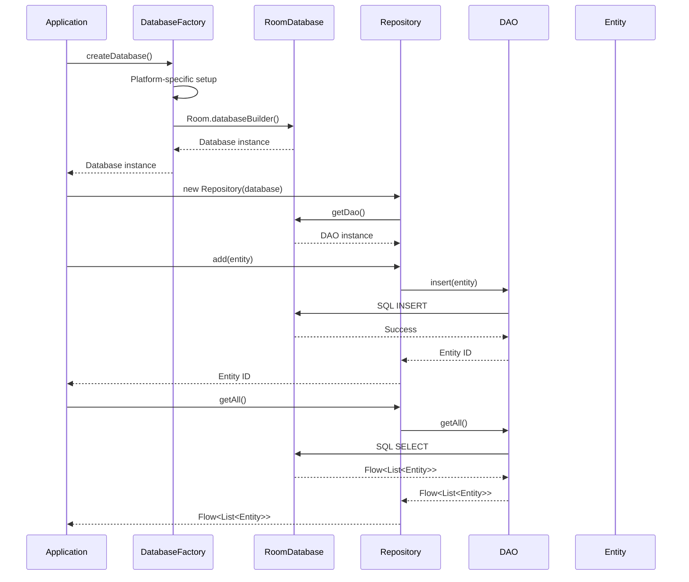
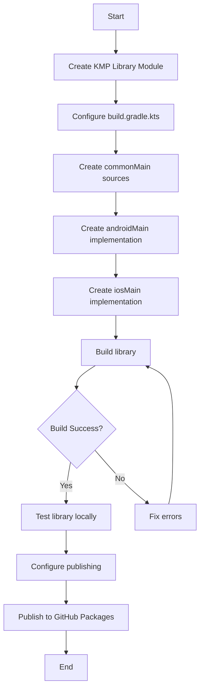
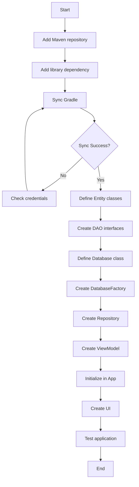
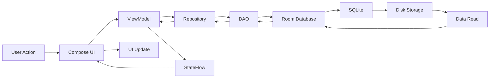
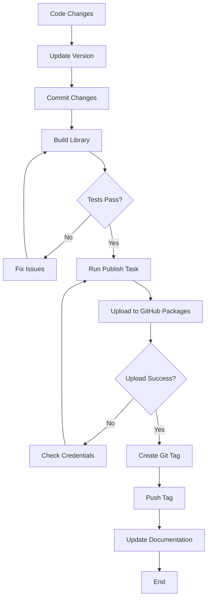

# KMP Room Core Library - Complete Documentation

**Version:** 1.0.2
**Package:** `com.brightly:kmp-room-core`
**Repository:** https://github.com/neeraj-brightly12/KMPDatabasePOC

---

## 📑 Table of Contents

1. [Overview](#overview)
2. [Architecture](#architecture)
3. [Library Structure](#library-structure)
4. [Code Flow & Implementation](#code-flow--implementation)
5. [How to Create the Library](#how-to-create-the-library)
6. [Publishing the Library](#publishing-the-library)
7. [How to Use the Library](#how-to-use-the-library)
8. [Implementing Room Database](#implementing-room-database)
9. [Visual Workflows](#visual-workflows)
10. [Complete Code Explanation](#complete-code-explanation)
11. [Version Management](#version-management)
12. [Troubleshooting](#troubleshooting)

---

## Overview

### What is KMP Room Core?

`kmp-room-core` is a **Kotlin Multiplatform library** that provides a generalized, reusable foundation for implementing Room Database in KMP projects targeting **Android** and **iOS**.

### Key Features

✅ **Platform-Agnostic Database Factory Pattern**
- Abstract database creation across Android and iOS
- Consistent API for both platforms

✅ **Base Repository Pattern**
- Eliminate boilerplate CRUD operations
- Type-safe generic repository implementation

✅ **Multiplatform Support**
- Android: Uses Android Context
- iOS: Uses NSHomeDirectory for file paths

✅ **Easy Integration**
- Single dependency addition
- Minimal setup required

✅ **Production Ready**
- Published to GitHub Packages
- Versioned releases
- Comprehensive documentation

### Technology Stack

| Component | Technology |
|-----------|----------|
| **Language** | Kotlin 2.1.21 |
| **Platform** | Kotlin Multiplatform |
| **Database** | Room 2.7.0 |
| **Build Tool** | Gradle 8.14.3 |
| **Targets** | Android, iOS (arm64, simulator) |
| **Publishing** | GitHub Packages |

---

## Architecture

### High-Level Architecture

```
┌─────────────────────────────────────────────────────────────┐
│                      Your KMP Application                    │
│  ┌───────────────────┐         ┌──────────────────────┐    │
│  │   UI Layer        │         │   Data Layer         │    │
│  │  (Compose)        │◄────────│  (Repositories)      │    │
│  └───────────────────┘         └──────────────────────┘    │
│                                           │                  │
│                                           ▼                  │
│                        ┌──────────────────────────────┐    │
│                        │   kmp-room-core Library      │    │
│                        │  ┌────────────────────────┐  │    │
│                        │  │  BaseDatabaseFactory   │  │    │
│                        │  │  BaseRepository        │  │    │
│                        │  └────────────────────────┘  │    │
│                        └──────────────────────────────┘    │
│                                     │                        │
│                ┌────────────────────┴────────────────┐      │
│                ▼                                     ▼       │
│    ┌─────────────────────┐           ┌──────────────────┐  │
│    │  Android Platform    │           │   iOS Platform   │  │
│    │  - Context           │           │  - NSHomeDir     │  │
│    │  - Room Android DB   │           │  - Room iOS DB   │  │
│    └─────────────────────┘           └──────────────────┘  │
└─────────────────────────────────────────────────────────────┘
```

### Layer Architecture

```
┌──────────────────────────────────────────────────┐
│              Presentation Layer                   │
│  ┌──────────────┐        ┌──────────────┐       │
│  │  ViewModels  │◄───────│  Compose UI  │       │
│  └──────────────┘        └──────────────┘       │
└──────────────────────────────────────────────────┘
                    │
                    ▼
┌──────────────────────────────────────────────────┐
│              Domain Layer (Optional)              │
│  ┌──────────────┐        ┌──────────────┐       │
│  │  Use Cases   │        │  Entities    │       │
│  └──────────────┘        └──────────────┘       │
└──────────────────────────────────────────────────┘
                    │
                    ▼
┌──────────────────────────────────────────────────┐
│              Data Layer                           │
│  ┌──────────────┐        ┌──────────────┐       │
│  │ Repositories │◄───────│  DAOs        │       │
│  └──────────────┘        └──────────────┘       │
│         │                        │               │
│         └────────────────────────┘               │
│                    ▼                              │
│  ┌─────────────────────────────────────┐        │
│  │   kmp-room-core (BaseRepository)    │        │
│  └─────────────────────────────────────┘        │
└──────────────────────────────────────────────────┘
                    │
                    ▼
┌──────────────────────────────────────────────────┐
│          Platform Layer (expect/actual)           │
│  ┌────────────────┐    ┌─────────────────┐      │
│  │  Android       │    │     iOS         │      │
│  │  Context-based │    │  NSHomeDir      │      │
│  └────────────────┘    └─────────────────┘      │
└──────────────────────────────────────────────────┘
```

### Design Patterns Used

#### 1. **Factory Pattern** (DatabaseFactory)
```kotlin
expect abstract class BaseDatabaseFactory<T : RoomDatabase> {
    abstract fun createDatabase(): T
}

// Android Implementation
actual abstract class BaseDatabaseFactory<T : RoomDatabase> actual constructor(
    private val context: Context
) {
    actual abstract fun createDatabase(): T
}

// iOS Implementation
actual abstract class BaseDatabaseFactory<T : RoomDatabase> actual constructor() {
    actual abstract fun createDatabase(): T
}
```

**Why?**
- Abstracts platform-specific database creation
- Provides consistent interface across platforms
- Encapsulates platform differences

#### 2. **Repository Pattern** (BaseRepository)
```kotlin
abstract class BaseRepository<E, D : BaseDao<E>>(
    protected val dao: D
) {
    suspend fun add(entity: E) = dao.insert(entity)
    suspend fun update(entity: E) = dao.update(entity)
    suspend fun delete(entity: E) = dao.delete(entity)
    fun getAll(): Flow<List<E>> = dao.getAll()
}
```

**Why?**
- Eliminates CRUD boilerplate
- Provides consistent data access layer
- Easy to extend with custom operations

#### 3. **Dependency Injection Pattern**
```kotlin
class ProductRepository(
    database: AppDatabase
) : BaseRepository<ProductEntity, ProductDao>(database.productDao())
```

**Why?**
- Loose coupling
- Easy testing with mocks
- Flexible database management

---

## Library Structure

### Project Structure

```
kmp-room-core/
├── build.gradle.kts              # Library build configuration
├── src/
│   ├── commonMain/
│   │   └── kotlin/
│   │       └── com/brightly/kmp/room/core/
│   │           ├── base/
│   │           │   ├── BaseDatabaseFactory.kt  # Abstract factory
│   │           │   ├── BaseDao.kt              # Base DAO interface
│   │           │   └── BaseRepository.kt       # Generic repository
│   │           └── utils/
│   │               └── DatabaseUtils.kt        # Helper utilities
│   ├── androidMain/
│   │   └── kotlin/
│   │       └── com/brightly/kmp/room/core/
│   │           └── android/
│   │               └── AndroidDatabaseFactory.kt  # Android impl
│   └── iosMain/
│       └── kotlin/
│           └── com/brightly/kmp/room/core/
│               └── ios/
│                   └── IosDatabaseFactory.kt      # iOS impl
└── README.md
```

### File Breakdown

#### 1. BaseDatabaseFactory.kt (Common)
```kotlin
package com.brightly.kmp.room.core.base

import androidx.room.RoomDatabase

/**
 * Abstract base class for creating Room databases across platforms.
 *
 * This factory pattern allows platform-specific database creation
 * while maintaining a common interface.
 */
expect abstract class BaseDatabaseFactory<T : RoomDatabase> {
    /**
     * Creates and returns a configured Room database instance.
     *
     * @return T The Room database instance
     */
    abstract fun createDatabase(): T
}
```

**Purpose:**
- Define common interface for database creation
- Use `expect` keyword for platform-specific implementations

#### 2. AndroidDatabaseFactory.kt (Android)
```kotlin
package com.brightly.kmp.room.core.android

import android.content.Context
import androidx.room.Room
import androidx.room.RoomDatabase
import com.brightly.kmp.room.core.base.BaseDatabaseFactory

/**
 * Android implementation of database factory.
 *
 * Uses Android Context to create Room database with proper file paths.
 */
actual abstract class BaseDatabaseFactory<T : RoomDatabase> actual constructor(
    private val context: Context
) {
    /**
     * Creates Room database using Android context.
     *
     * Subclasses must implement this to provide the specific database builder.
     */
    actual abstract fun createDatabase(): T

    /**
     * Helper method to create database builder with context.
     */
    protected fun <T : RoomDatabase> getDatabaseBuilder(
        klass: Class<T>,
        name: String
    ): RoomDatabase.Builder<T> {
        val appContext = context.applicationContext
        val dbFile = appContext.getDatabasePath(name)
        return Room.databaseBuilder(
            context = appContext,
            klass = klass,
            name = dbFile.absolutePath
        )
    }
}
```

**Key Points:**
- Requires Android `Context`
- Uses `Room.databaseBuilder`
- Handles file path with `getDatabasePath()`

#### 3. IosDatabaseFactory.kt (iOS)
```kotlin
package com.brightly.kmp.room.core.ios

import androidx.room.Room
import androidx.room.RoomDatabase
import com.brightly.kmp.room.core.base.BaseDatabaseFactory
import platform.Foundation.NSHomeDirectory

/**
 * iOS implementation of database factory.
 *
 * Uses NSHomeDirectory to determine database file location.
 */
actual abstract class BaseDatabaseFactory<T : RoomDatabase> actual constructor() {
    actual abstract fun createDatabase(): T

    /**
     * Helper method to create database builder for iOS.
     *
     * Uses NSHomeDirectory to get app's home directory.
     */
    protected fun <T : RoomDatabase> getDatabaseBuilder(
        klass: Class<T>,
        name: String
    ): RoomDatabase.Builder<T> {
        val dbFile = NSHomeDirectory() + "/$name"
        return Room.databaseBuilder(
            name = dbFile,
            factory = { klass.newInstance() }
        )
    }
}
```

**Key Points:**
- No Context needed
- Uses `NSHomeDirectory()` for file path
- Different Room.databaseBuilder signature

#### 4. BaseDao.kt
```kotlin
package com.brightly.kmp.room.core.base

import androidx.room.*
import kotlinx.coroutines.flow.Flow

/**
 * Base DAO interface with common CRUD operations.
 *
 * All DAOs should extend this to get basic functionality.
 */
interface BaseDao<T> {
    @Insert(onConflict = OnConflictStrategy.REPLACE)
    suspend fun insert(entity: T): Long

    @Update
    suspend fun update(entity: T)

    @Delete
    suspend fun delete(entity: T)

    @Query("SELECT * FROM :tableName")
    fun getAll(): Flow<List<T>>
}
```

#### 5. BaseRepository.kt
```kotlin
package com.brightly.kmp.room.core.base

import kotlinx.coroutines.flow.Flow

/**
 * Generic repository providing common database operations.
 *
 * Eliminates boilerplate by providing standard CRUD methods.
 *
 * @param E Entity type
 * @param D DAO type extending BaseDao
 */
abstract class BaseRepository<E, D : BaseDao<E>>(
    protected val dao: D
) {
    /**
     * Insert a new entity.
     */
    suspend fun add(entity: E): Long = dao.insert(entity)

    /**
     * Update an existing entity.
     */
    suspend fun update(entity: E) = dao.update(entity)

    /**
     * Delete an entity.
     */
    suspend fun delete(entity: E) = dao.delete(entity)

    /**
     * Get all entities as a Flow.
     */
    fun getAll(): Flow<List<E>> = dao.getAll()
}
```

---

## Code Flow & Implementation

### Step-by-Step Code Flow



### Initialization Flow

**1. Application Startup**
```kotlin
// Android: MainActivity
class MainActivity : ComponentActivity() {
    override fun onCreate(savedInstanceState: Bundle?) {
        super.onCreate(savedInstanceState)
        setContent {
            App(databaseFactory = DatabaseFactory(applicationContext))
        }
    }
}

// iOS: MainViewController
fun MainViewController() = ComposeUIViewController {
    App(databaseFactory = DatabaseFactory())
}
```

**2. Database Creation**
```kotlin
@Composable
fun App(databaseFactory: DatabaseFactory) {
    // Create database instance (happens once)
    val database = remember { databaseFactory.createDatabase() }

    // Create repository
    val repository = remember { UserRepository(database) }

    // Create ViewModel
    val viewModel: UserViewModel = viewModel {
        UserViewModel(repository)
    }

    // Render UI
    UserScreen(viewModel)
}
```

**3. Data Operations**
```kotlin
// ViewModel
class UserViewModel(private val repository: UserRepository) : ViewModel() {
    private val _users = MutableStateFlow<List<User>>(emptyList())
    val users: StateFlow<List<User>> = _users

    init {
        loadUsers()
    }

    private fun loadUsers() {
        viewModelScope.launch {
            repository.getAll().collect { userList ->
                _users.value = userList
            }
        }
    }

    fun addUser(name: String) {
        viewModelScope.launch {
            repository.add(UserEntity(name = name))
        }
    }
}
```

### Data Flow Diagram

```
┌─────────────┐
│   UI Layer  │ (Compose Screens)
└──────┬──────┘
       │ User Action (button click)
       ▼
┌─────────────┐
│  ViewModel  │ (State Management)
└──────┬──────┘
       │ viewModelScope.launch
       ▼
┌─────────────┐
│ Repository  │ (Data Access)
└──────┬──────┘
       │ suspend fun / Flow
       ▼
┌─────────────┐
│     DAO     │ (Room Queries)
└──────┬──────┘
       │ @Query, @Insert, etc.
       ▼
┌─────────────┐
│  Database   │ (SQLite)
└─────────────┘
```

---

## How to Create the Library

### Step 1: Create Library Module

**1.1 In Android Studio:**
```
File → New → New Module → Kotlin Multiplatform Library
Module name: kmp-room-core
Package name: com.brightly.kmp.room.core
```

**1.2 Or manually create:**
```bash
mkdir kmp-room-core
cd kmp-room-core
```

### Step 2: Configure build.gradle.kts

**kmp-room-core/build.gradle.kts:**
```kotlin
plugins {
    alias(libs.plugins.kotlinMultiplatform)
    alias(libs.plugins.androidLibrary)
    alias(libs.plugins.ksp)
    `maven-publish`
}

group = "com.brightly"
version = "1.0.2"

kotlin {
    androidTarget {
        publishLibraryVariants("release")
        compilerOptions {
            jvmTarget.set(JvmTarget.JVM_11)
        }
    }

    listOf(
        iosArm64(),
        iosSimulatorArm64()
    ).forEach {
        it.binaries.framework {
            baseName = "kmp-room-core"
            isStatic = true
        }
    }

    sourceSets {
        commonMain.dependencies {
            implementation(libs.androidx.room.runtime)
            implementation(libs.kotlinx.coroutines.core)
        }

        androidMain.dependencies {
            implementation(libs.androidx.room.runtime.android)
        }

        iosMain.dependencies {
            // iOS-specific dependencies
        }
    }
}

android {
    namespace = "com.brightly.kmp.room.core"
    compileSdk = 35

    defaultConfig {
        minSdk = 24
    }

    compileOptions {
        sourceCompatibility = JavaVersion.VERSION_11
        targetCompatibility = JavaVersion.VERSION_11
    }
}

// Publishing configuration
publishing {
    repositories {
        maven {
            name = "GitHubPackages"
            url = uri("https://maven.pkg.github.com/neeraj-brightly12/KMPDatabasePOC")
            credentials {
                username = project.findProperty("gpr.user") as String? ?: System.getenv("GPR_USER")
                password = project.findProperty("gpr.token") as String? ?: System.getenv("GPR_TOKEN")
            }
        }
    }

    publications {
        withType<MavenPublication> {
            artifactId = "kmp-room-core"

            pom {
                name.set("KMP Room Core")
                description.set("Kotlin Multiplatform Room Database Core Library")
                url.set("https://github.com/neeraj-brightly12/KMPDatabasePOC")

                licenses {
                    license {
                        name.set("The Apache License, Version 2.0")
                        url.set("http://www.apache.org/licenses/LICENSE-2.0.txt")
                    }
                }

                developers {
                    developer {
                        id.set("neeraj-brightly12")
                        name.set("Neeraj Soni")
                        email.set("neeraj.soni@brightlysoftware.com")
                    }
                }
            }
        }
    }
}
```

### Step 3: Create Source Files

**3.1 Common Main (BaseDatabaseFactory.kt)**

Create: `src/commonMain/kotlin/com/brightly/kmp/room/core/base/BaseDatabaseFactory.kt`

```kotlin
package com.brightly.kmp.room.core.base

import androidx.room.RoomDatabase

expect abstract class BaseDatabaseFactory<T : RoomDatabase> {
    abstract fun createDatabase(): T
}
```

**3.2 Android Implementation**

Create: `src/androidMain/kotlin/com/brightly/kmp/room/core/android/AndroidDatabaseFactory.kt`

```kotlin
package com.brightly.kmp.room.core.android

import android.content.Context
import androidx.room.Room
import androidx.room.RoomDatabase
import com.brightly.kmp.room.core.base.BaseDatabaseFactory

actual abstract class BaseDatabaseFactory<T : RoomDatabase> actual constructor(
    private val context: Context
) {
    actual abstract fun createDatabase(): T

    protected fun <T : RoomDatabase> getDatabaseBuilder(
        klass: Class<T>,
        name: String
    ): RoomDatabase.Builder<T> {
        val appContext = context.applicationContext
        val dbFile = appContext.getDatabasePath(name)
        return Room.databaseBuilder(
            context = appContext,
            klass = klass,
            name = dbFile.absolutePath
        )
    }
}
```

**3.3 iOS Implementation**

Create: `src/iosMain/kotlin/com/brightly/kmp/room/core/ios/IosDatabaseFactory.kt`

```kotlin
package com.brightly.kmp.room.core.ios

import androidx.room.Room
import androidx.room.RoomDatabase
import com.brightly.kmp.room.core.base.BaseDatabaseFactory
import platform.Foundation.NSHomeDirectory

actual abstract class BaseDatabaseFactory<T : RoomDatabase> actual constructor() {
    actual abstract fun createDatabase(): T

    protected fun <T : RoomDatabase> getDatabaseBuilder(
        klass: Class<T>,
        name: String
    ): RoomDatabase.Builder<T> {
        val dbFile = NSHomeDirectory() + "/$name"
        return Room.databaseBuilder(
            name = dbFile,
            factory = { klass.newInstance() }
        )
    }
}
```

**3.4 BaseRepository.kt**

Create: `src/commonMain/kotlin/com/brightly/kmp/room/core/base/BaseRepository.kt`

```kotlin
package com.brightly.kmp.room.core.base

import kotlinx.coroutines.flow.Flow

abstract class BaseRepository<E, D : BaseDao<E>>(
    protected val dao: D
) {
    suspend fun add(entity: E): Long = dao.insert(entity)
    suspend fun update(entity: E) = dao.update(entity)
    suspend fun delete(entity: E) = dao.delete(entity)
    fun getAll(): Flow<List<E>> = dao.getAll()
}
```

**3.5 BaseDao.kt**

Create: `src/commonMain/kotlin/com/brightly/kmp/room/core/base/BaseDao.kt`

```kotlin
package com.brightly.kmp.room.core.base

import androidx.room.*
import kotlinx.coroutines.flow.Flow

interface BaseDao<T> {
    @Insert(onConflict = OnConflictStrategy.REPLACE)
    suspend fun insert(entity: T): Long

    @Update
    suspend fun update(entity: T)

    @Delete
    suspend fun delete(entity: T)

    fun getAll(): Flow<List<T>>
}
```

### Step 4: Add Module to settings.gradle.kts

**Root settings.gradle.kts:**
```kotlin
include(":kmp-room-core")
```

### Step 5: Build the Library

```bash
./gradlew :kmp-room-core:build
```

---

## Publishing the Library

### Step 1: Setup GitHub Token

**1.1 Create Personal Access Token:**
1. Go to https://github.com/settings/tokens
2. Click "Generate new token (classic)"
3. Name: "KMP Room Core Publishing"
4. Scopes: `write:packages`, `read:packages`
5. Generate and copy token

**1.2 Add to gradle.properties:**

Create/edit `~/.gradle/gradle.properties`:
```properties
gpr.user=your-github-username
gpr.token=your_github_token_here
```

⚠️ **Never commit this file!**

### Step 2: Publish to GitHub Packages

```bash
# Publish all variants
./gradlew :kmp-room-core:publish

# Or publish specific variant
./gradlew :kmp-room-core:publishAndroidReleasePublicationToGitHubPackagesRepository
./gradlew :kmp-room-core:publishIosArm64PublicationToGitHubPackagesRepository
./gradlew :kmp-room-core:publishIosSimulatorArm64PublicationToGitHubPackagesRepository
```

### Step 3: Verify Publication

1. Go to your GitHub repository
2. Click on "Packages" (right sidebar)
3. You should see `kmp-room-core` package

---

## How to Use the Library

### Step 1: Add Maven Repository

**Root build.gradle.kts:**
```kotlin
allprojects {
    repositories {
        google()
        mavenCentral()
        maven {
            url = uri("https://maven.pkg.github.com/neeraj-brightly12/KMPDatabasePOC")
            credentials {
                username = project.findProperty("gpr.user") as String? ?: System.getenv("GPR_USER")
                password = project.findProperty("gpr.token") as String? ?: System.getenv("GPR_TOKEN")
            }
        }
    }
}
```

### Step 2: Add Dependency

**composeApp/build.gradle.kts:**
```kotlin
commonMain.dependencies {
    implementation("com.brightly:kmp-room-core:1.0.2")
}
```

### Step 3: Setup Credentials

Add to `~/.gradle/gradle.properties`:
```properties
gpr.user=your-github-username
gpr.token=your_github_token_with_read_packages_permission
```

### Step 4: Sync Project

```bash
./gradlew build
```

---

## Implementing Room Database

### Complete Implementation Example

#### Step 1: Define Entity

**UserEntity.kt:**
```kotlin
package com.example.data.entity

import androidx.room.Entity
import androidx.room.PrimaryKey

@Entity(tableName = "users")
data class UserEntity(
    @PrimaryKey(autoGenerate = true)
    val id: Int = 0,
    val name: String,
    val email: String
)
```

#### Step 2: Create DAO

**UserDao.kt:**
```kotlin
package com.example.data.dao

import androidx.room.*
import com.brightly.kmp.room.core.base.BaseDao
import com.example.data.entity.UserEntity
import kotlinx.coroutines.flow.Flow

@Dao
interface UserDao : BaseDao<UserEntity> {
    // Base methods inherited: insert, update, delete, getAll

    // Custom queries
    @Query("SELECT * FROM users WHERE id = :id")
    suspend fun getUserById(id: Int): UserEntity?

    @Query("SELECT * FROM users WHERE email = :email")
    fun getUserByEmail(email: String): Flow<UserEntity?>

    @Query("DELETE FROM users")
    suspend fun deleteAll()

    override fun getAll(): Flow<List<UserEntity>> {
        return getAllUsers()
    }

    @Query("SELECT * FROM users")
    fun getAllUsers(): Flow<List<UserEntity>>
}
```

#### Step 3: Define Database

**AppDatabase.kt:**
```kotlin
package com.example.data.database

import androidx.room.ConstructedBy
import androidx.room.Database
import androidx.room.RoomDatabase
import androidx.room.RoomDatabaseConstructor
import com.example.data.dao.UserDao
import com.example.data.entity.UserEntity

@Database(
    entities = [UserEntity::class],
    version = 1,
    exportSchema = false
)
@ConstructedBy(AppDatabaseConstructor::class)
abstract class AppDatabase : RoomDatabase() {
    abstract fun userDao(): UserDao
}

@Suppress("NO_ACTUAL_FOR_EXPECT")
expect object AppDatabaseConstructor : RoomDatabaseConstructor<AppDatabase> {
    override fun initialize(): AppDatabase
}
```

#### Step 4: Create Database Factory

**DatabaseFactory.kt (Common):**
```kotlin
package com.example.data.database

import com.brightly.kmp.room.core.base.BaseDatabaseFactory

expect class DatabaseFactory : BaseDatabaseFactory<AppDatabase> {
    override fun createDatabase(): AppDatabase
}
```

**DatabaseFactory.android.kt:**
```kotlin
package com.example.data.database

import android.content.Context
import androidx.room.Room
import com.brightly.kmp.room.core.android.BaseDatabaseFactory

actual class DatabaseFactory actual constructor(
    private val context: Context
) : BaseDatabaseFactory<AppDatabase>(context) {

    actual override fun createDatabase(): AppDatabase {
        return getDatabaseBuilder(
            AppDatabase::class.java,
            "app_database.db"
        )
        .fallbackToDestructiveMigration(true)
        .build()
    }
}
```

**DatabaseFactory.ios.kt:**
```kotlin
package com.example.data.database

import androidx.room.Room
import com.brightly.kmp.room.core.ios.BaseDatabaseFactory

actual class DatabaseFactory actual constructor() : BaseDatabaseFactory<AppDatabase>() {

    actual override fun createDatabase(): AppDatabase {
        return getDatabaseBuilder(
            AppDatabase::class.java,
            "app_database.db"
        )
        .fallbackToDestructiveMigration(true)
        .build()
    }
}
```

#### Step 5: Create Repository

**UserRepository.kt:**
```kotlin
package com.example.data.repository

import com.brightly.kmp.room.core.base.BaseRepository
import com.example.data.dao.UserDao
import com.example.data.database.AppDatabase
import com.example.data.entity.UserEntity
import kotlinx.coroutines.flow.Flow

class UserRepository(
    database: AppDatabase
) : BaseRepository<UserEntity, UserDao>(database.userDao()) {

    // Base methods available: add(), update(), delete(), getAll()

    // Custom repository methods
    suspend fun getUserById(id: Int): UserEntity? {
        return dao.getUserById(id)
    }

    fun getUserByEmail(email: String): Flow<UserEntity?> {
        return dao.getUserByEmail(email)
    }

    suspend fun deleteAll() {
        dao.deleteAll()
    }
}
```

#### Step 6: Create ViewModel

**UserViewModel.kt:**
```kotlin
package com.example.viewmodel

import androidx.lifecycle.ViewModel
import androidx.lifecycle.viewModelScope
import com.example.data.entity.UserEntity
import com.example.data.repository.UserRepository
import kotlinx.coroutines.flow.MutableStateFlow
import kotlinx.coroutines.flow.StateFlow
import kotlinx.coroutines.launch

class UserViewModel(
    private val repository: UserRepository
) : ViewModel() {

    private val _users = MutableStateFlow<List<UserEntity>>(emptyList())
    val users: StateFlow<List<UserEntity>> = _users

    private val _isLoading = MutableStateFlow(false)
    val isLoading: StateFlow<Boolean> = _isLoading

    init {
        loadUsers()
    }

    private fun loadUsers() {
        viewModelScope.launch {
            repository.getAll().collect { userList ->
                _users.value = userList
            }
        }
    }

    fun addUser(name: String, email: String) {
        viewModelScope.launch {
            repository.add(UserEntity(name = name, email = email))
        }
    }

    fun updateUser(user: UserEntity) {
        viewModelScope.launch {
            repository.update(user)
        }
    }

    fun deleteUser(user: UserEntity) {
        viewModelScope.launch {
            repository.delete(user)
        }
    }
}
```

#### Step 7: Initialize in App

**App.kt (Common):**
```kotlin
package com.example.ui

import androidx.compose.runtime.Composable
import androidx.compose.runtime.remember
import androidx.lifecycle.viewmodel.compose.viewModel
import com.example.data.database.DatabaseFactory
import com.example.data.repository.UserRepository
import com.example.viewmodel.UserViewModel

@Composable
fun App(databaseFactory: DatabaseFactory) {
    val database = remember { databaseFactory.createDatabase() }
    val repository = remember { UserRepository(database) }
    val viewModel: UserViewModel = viewModel { UserViewModel(repository) }

    UserScreen(viewModel)
}
```

**MainActivity.kt (Android):**
```kotlin
package com.example

import android.os.Bundle
import androidx.activity.ComponentActivity
import androidx.activity.compose.setContent
import com.example.data.database.DatabaseFactory
import com.example.ui.App

class MainActivity : ComponentActivity() {
    override fun onCreate(savedInstanceState: Bundle?) {
        super.onCreate(savedInstanceState)
        setContent {
            App(databaseFactory = DatabaseFactory(applicationContext))
        }
    }
}
```

**MainViewController.kt (iOS):**
```kotlin
package com.example

import androidx.compose.ui.window.ComposeUIViewController
import com.example.data.database.DatabaseFactory
import com.example.ui.App

fun MainViewController() = ComposeUIViewController {
    App(databaseFactory = DatabaseFactory())
}
```

#### Step 8: Create UI

**UserScreen.kt:**
```kotlin
package com.example.ui

import androidx.compose.foundation.layout.*
import androidx.compose.foundation.lazy.LazyColumn
import androidx.compose.foundation.lazy.items
import androidx.compose.material3.*
import androidx.compose.runtime.*
import androidx.compose.ui.Modifier
import androidx.compose.ui.unit.dp
import com.example.viewmodel.UserViewModel

@Composable
fun UserScreen(viewModel: UserViewModel) {
    val users by viewModel.users.collectAsState()
    var name by remember { mutableStateOf("") }
    var email by remember { mutableStateOf("") }

    Column(
        modifier = Modifier
            .fillMaxSize()
            .padding(16.dp)
    ) {
        Text(
            text = "Users",
            style = MaterialTheme.typography.headlineMedium
        )

        Spacer(modifier = Modifier.height(16.dp))

        OutlinedTextField(
            value = name,
            onValueChange = { name = it },
            label = { Text("Name") },
            modifier = Modifier.fillMaxWidth()
        )

        Spacer(modifier = Modifier.height(8.dp))

        OutlinedTextField(
            value = email,
            onValueChange = { email = it },
            label = { Text("Email") },
            modifier = Modifier.fillMaxWidth()
        )

        Spacer(modifier = Modifier.height(8.dp))

        Button(
            onClick = {
                if (name.isNotBlank() && email.isNotBlank()) {
                    viewModel.addUser(name, email)
                    name = ""
                    email = ""
                }
            },
            modifier = Modifier.fillMaxWidth()
        ) {
            Text("Add User")
        }

        Spacer(modifier = Modifier.height(16.dp))

        LazyColumn {
            items(users) { user ->
                Card(
                    modifier = Modifier
                        .fillMaxWidth()
                        .padding(vertical = 4.dp)
                ) {
                    Column(modifier = Modifier.padding(16.dp)) {
                        Text(text = user.name, style = MaterialTheme.typography.titleMedium)
                        Text(text = user.email, style = MaterialTheme.typography.bodyMedium)
                    }
                }
            }
        }
    }
}
```

---

## Visual Workflows

### Library Creation Workflow



### Application Integration Workflow



### Data Flow Workflow



### Publishing Workflow



---

## Complete Code Explanation

### 1. expect/actual Pattern

**Why it's needed:**
Kotlin Multiplatform uses `expect/actual` to handle platform-specific code.

**Common (expect):**
```kotlin
expect class DatabaseFactory {
    fun createDatabase(): AppDatabase
}
```

**Android (actual):**
```kotlin
actual class DatabaseFactory(private val context: Context) {
    actual fun createDatabase(): AppDatabase {
        // Android-specific implementation
    }
}
```

**iOS (actual):**
```kotlin
actual class DatabaseFactory {
    actual fun createDatabase(): AppDatabase {
        // iOS-specific implementation
    }
}
```

### 2. Generic Type Parameters

**BaseRepository<E, D>:**
- `E`: Entity type (e.g., UserEntity)
- `D`: DAO type (e.g., UserDao)

**Benefits:**
- Type safety
- Code reuse
- Compile-time checks

**Example:**
```kotlin
class UserRepository(database: AppDatabase)
    : BaseRepository<UserEntity, UserDao>(database.userDao())
//                    ↑           ↑
//                    Entity      DAO type
```

### 3. Flow vs suspend

**Flow** - For continuous data streams:
```kotlin
fun getAll(): Flow<List<User>>  // Emits every time data changes
```

**suspend** - For one-time operations:
```kotlin
suspend fun add(user: User): Long  // Returns once after completion
```

### 4. Room Annotations

**@Entity** - Marks a data class as database table:
```kotlin
@Entity(tableName = "users")
data class User(
    @PrimaryKey(autoGenerate = true) val id: Int = 0,
    val name: String
)
```

**@Dao** - Marks interface as Data Access Object:
```kotlin
@Dao
interface UserDao {
    @Query("SELECT * FROM users")
    fun getAll(): Flow<List<User>>
}
```

**@Database** - Marks class as Room database:
```kotlin
@Database(entities = [User::class], version = 1)
abstract class AppDatabase : RoomDatabase() {
    abstract fun userDao(): UserDao
}
```

### 5. Dependency Injection

**Constructor Injection:**
```kotlin
class UserRepository(
    database: AppDatabase  // Injected dependency
) : BaseRepository<UserEntity, UserDao>(database.userDao())
```

**Benefits:**
- Testable (can inject mocks)
- Flexible (can swap implementations)
- Clear dependencies

### 6. ViewModel Scope

**viewModelScope:**
- Lifecycle-aware coroutine scope
- Automatically cancelled when ViewModel is cleared
- Safe for UI operations

```kotlin
viewModelScope.launch {
    repository.getAll().collect { users ->
        _users.value = users
    }
}
```

---

## Version Management

### Semantic Versioning

Format: `MAJOR.MINOR.PATCH`

- **MAJOR**: Incompatible API changes
- **MINOR**: New features (backward compatible)
- **PATCH**: Bug fixes

**Example:**
- 1.0.0 → Initial release
- 1.0.1 → Bug fix
- 1.1.0 → New feature (backward compatible)
- 2.0.0 → Breaking changes

### Publishing a New Version

**Step 1: Update Version**

Edit `kmp-room-core/build.gradle.kts`:
```kotlin
version = "1.0.3"  // Increment version
```

**Step 2: Update Changelog**

Create/update `CHANGELOG.md`:
```markdown
# Changelog

## [1.0.3] - 2026-03-24

### Added
- New helper method for database migrations

### Fixed
- iOS database path issue on simulator

### Changed
- Improved error handling in BaseRepository
```

**Step 3: Commit Changes**

```bash
git add .
git commit -m "chore: bump version to 1.0.3"
```

**Step 4: Create Git Tag**

```bash
git tag v1.0.3
git push origin v1.0.3
```

**Step 5: Publish**

```bash
./gradlew :kmp-room-core:publish
```

**Step 6: Update Documentation**

Update README with new version number:
```kotlin
implementation("com.brightly:kmp-room-core:1.0.3")
```

---

## Troubleshooting

### Common Issues

#### Issue 1: "Package not found"

**Error:**
```
Could not find com.brightly:kmp-room-core:1.0.2
```

**Solutions:**
1. Check credentials in `~/.gradle/gradle.properties`
2. Verify token has `read:packages` permission
3. Ensure repository URL is correct
4. Try: `./gradlew build --refresh-dependencies`

#### Issue 2: "Context not found" on iOS

**Error:**
```
Unresolved reference: Context
```

**Solution:**
iOS doesn't need Context. Use the no-arg constructor:
```kotlin
// iOS
actual class DatabaseFactory actual constructor()
    : BaseDatabaseFactory<AppDatabase>()
```

#### Issue 3: "Database file not created"

**Solutions:**

**Android:**
```kotlin
// Use applicationContext, not activity context
val dbFile = context.applicationContext.getDatabasePath(name)
```

**iOS:**
```kotlin
// Ensure proper NSHomeDirectory usage
val dbFile = NSHomeDirectory() + "/$name"
```

#### Issue 4: "Flow not collecting"

**Problem:**
```kotlin
repository.getAll()  // Does nothing!
```

**Solution:**
```kotlin
// Must collect the Flow
repository.getAll().collect { users ->
    // Handle data
}
```

#### Issue 5: "ViewModel not surviving rotation"

**Solution:**
```kotlin
// Use viewModel() function from lifecycle
val viewModel: UserViewModel = viewModel {
    UserViewModel(repository)
}
```

#### Issue 6: "Compile error: Cannot access class"

**Solution:**
Ensure KSP is configured for all targets:
```kotlin
dependencies {
    add("kspAndroid", "androidx.room:room-compiler:2.7.0")
    add("kspIosArm64", "androidx.room:room-compiler:2.7.0")
    add("kspIosSimulatorArm64", "androidx.room:room-compiler:2.7.0")
}
```

---

## Best Practices

### 1. Database Design

✅ **DO:**
- Use meaningful table and column names
- Add indexes for frequently queried columns
- Use appropriate data types
- Implement migrations for schema changes

❌ **DON'T:**
- Store large files in database (use file path instead)
- Use overly complex queries
- Ignore database versioning

### 2. Repository Pattern

✅ **DO:**
- Keep repository methods simple and focused
- Return Flow for data that changes
- Use suspend for one-time operations
- Handle errors appropriately

❌ **DON'T:**
- Put business logic in repository
- Return LiveData (use Flow instead)
- Expose DAO directly to UI layer

### 3. ViewModel

✅ **DO:**
- Use StateFlow for UI state
- Launch coroutines in viewModelScope
- Handle loading and error states
- Validate input before repository calls

❌ **DON'T:**
- Hold Context reference
- Perform long-running operations without feedback
- Update UI directly from repository

### 4. UI Layer

✅ **DO:**
- Collect state as State in Compose
- Use remember for expensive operations
- Show loading indicators
- Handle empty states gracefully

❌ **DON'T:**
- Call repository directly from UI
- Use mutableStateOf without remember
- Block UI thread

---

## Performance Tips

### 1. Database Optimization

```kotlin
// Add indexes
@Entity(
    tableName = "users",
    indices = [Index(value = ["email"], unique = true)]
)

// Use pagination for large lists
@Query("SELECT * FROM users LIMIT :limit OFFSET :offset")
fun getUsersPaged(limit: Int, offset: Int): Flow<List<User>>
```

### 2. Flow Optimization

```kotlin
// Use conflated for UI updates
repository.getAll()
    .conflate()  // Skip intermediate values
    .collect { users ->
        // Update UI
    }

// Use debounce for search
searchQuery
    .debounce(300)  // Wait 300ms after typing stops
    .collect { query ->
        // Search
    }
```

### 3. Compose Optimization

```kotlin
// Use keys in lists
LazyColumn {
    items(users, key = { it.id }) { user ->
        UserCard(user)
    }
}

// Cache expensive calculations
val filtered = remember(users, query) {
    users.filter { it.name.contains(query) }
}
```

---

## Testing

### Unit Testing Repository

```kotlin
class UserRepositoryTest {
    private lateinit var database: AppDatabase
    private lateinit var repository: UserRepository

    @Before
    fun setup() {
        database = Room.inMemoryDatabaseBuilder(
            context, AppDatabase::class.java
        ).build()
        repository = UserRepository(database)
    }

    @Test
    fun `add user should insert into database`() = runTest {
        val user = UserEntity(name = "Test", email = "test@test.com")

        repository.add(user)

        val users = repository.getAll().first()
        assert(users.size == 1)
        assert(users[0].name == "Test")
    }

    @After
    fun teardown() {
        database.close()
    }
}
```

---

## Summary

This library provides:
✅ Platform-agnostic Room database setup
✅ Reusable repository pattern
✅ Type-safe generic implementations
✅ Easy integration into KMP projects
✅ Production-ready code

**Next Steps:**
1. Integrate library into your project
2. Define your entities and DAOs
3. Create repositories using BaseRepository
4. Build your UI with Compose
5. Enjoy simplified database management!

---

## Additional Resources

- **GitHub Repository**: https://github.com/neeraj-brightly12/KMPDatabasePOC
- **Room Documentation**: https://developer.android.com/training/data-storage/room
- **KMP Documentation**: https://kotlinlang.org/docs/multiplatform.html
- **Compose Multiplatform**: https://www.jetbrains.com/lp/compose-multiplatform/

---

**Document Version:** 1.0
**Last Updated:** March 24, 2026
**Author:** Neeraj Soni (neeraj.soni@brightlysoftware.com)